# NEUROZEN - Your Personal Health & Wellness Companion

NEUROZEN is a **Physical & Mental Health and Wellness** platform that provides a **personalized experience** to help users achieve their **health goals**. 

## 🚀 Features
- **🧘 Mood-Based Personalized Recommendations**
- **📅 Daily Mood Logs with AI-Generated Motivations**
- **⚡ Seamless Profile Setup & Onboarding**
- **📖 Personalized Daily Health Guide**
- **🎵 Mood-Based Music & Breathing Exercises**
- **✍️ CBT Thought Journaling & Reframing**
- **💬 AI Chatbot for Mental Health Support**
- **🩺 Therapist Booking & Secure Payment Gateway**

---

## Tech Stack
-  **MongoDB**  
-  **Express.js**  
-  **React.js**  
-  **Node.js**  
-  **Gemini API**  
-  **Google Fit API**  
-  **Razorpay Payment Gateway**  

---

## 🛠 Getting Started

### 1️⃣ Clone the Repository
```sh
git clone https://github.com/CODExJATIN/NEUROZEN.git
cd NEUROZEN
```

### 2️⃣ Setup Frontend
```sh
cd frontend
npm install
```
Create a `.env` file in the `frontend` folder and add:
```sh
VITE_GEMINI_API_KEY=your_api_key_here
```
Then start the frontend:
```sh
npm run dev
```

### 3️⃣ Setup Backend
```sh
cd backend
npm install
```
Create a `.env` file in the `backend` folder and add:
```sh
PORT=your_port_here
MONGODB_URI=your_mongodb_connection_string
JWT_SECRET=your_secure_jwt_secret_key_here
NODE_ENV=development
GOOGLE_CLIENT_ID=your_google_client_id
```
Then start the backend:
```sh
npm start
```

---

## Screenshots
### 🔹 **Landing Page**  
#### First impression of NEUROZEN.  
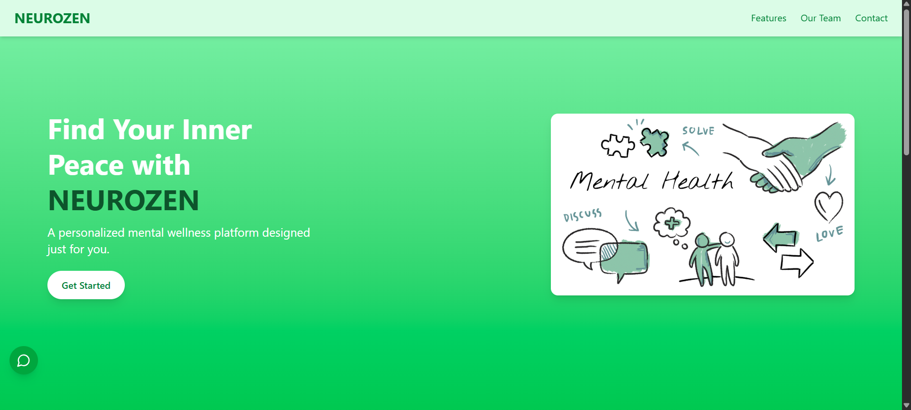  
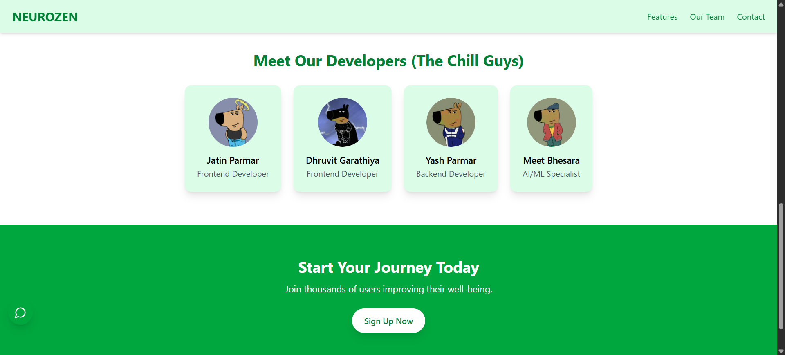  

### 🔹 **Homepage**
#### Your Daily Health Guide & Mood based personalized recommendations, also you can connect with your google fit account to track your step count

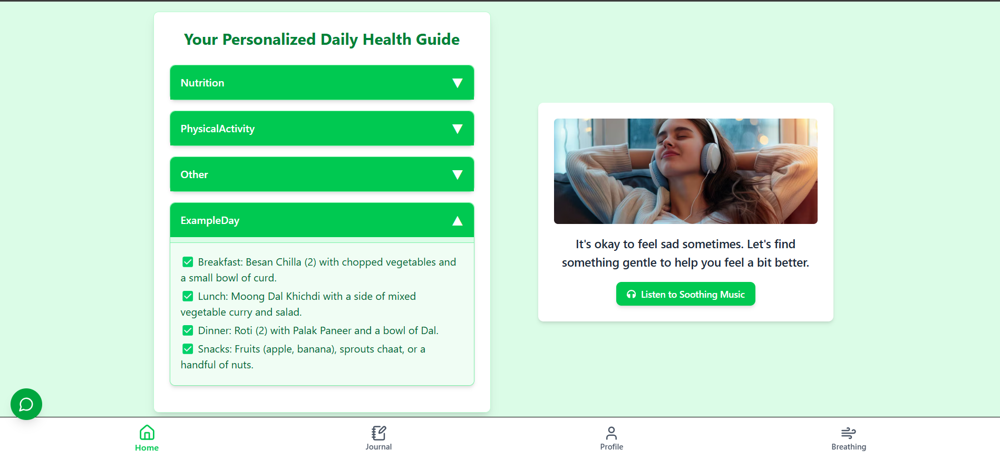.

### 🔹 **Mood Logs & AI Motivations**
#### Log your mood daily and receive a motivating message from AI. Your logged mood will also help personalize your experience.
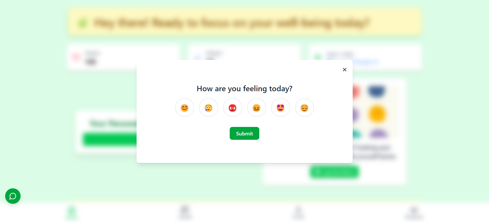
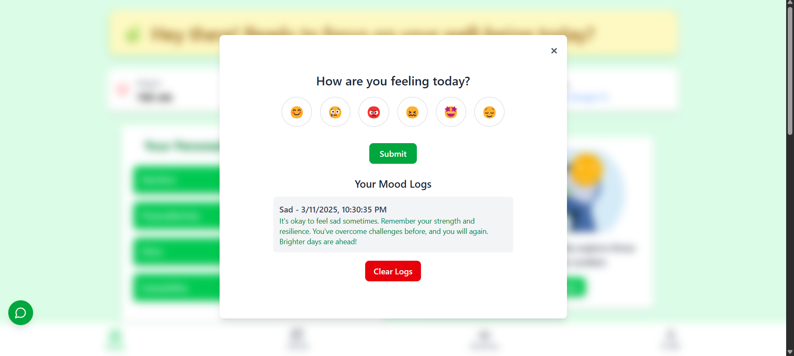

### 🔹 **Breathing Exercise & Mood-based Recommendations**  
#### Personalized breathing exercises based on your mood to help you relax and stay mindful.  
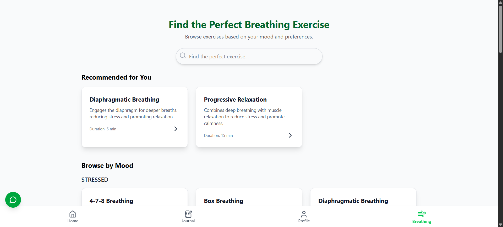  
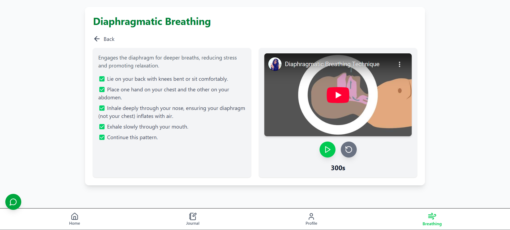  

### 🔹 **CBT Thought Journaling & Reframing**  
#### Cognitive Behavioral Therapy (CBT) based journaling to reframe negative thoughts with a positive perspective.  
  
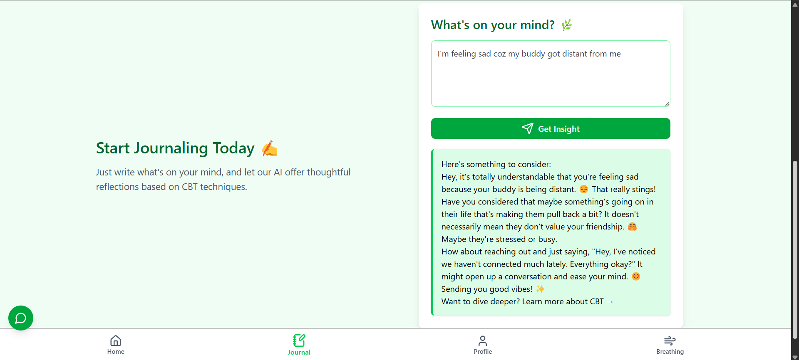  

### 🔹 **Therapist Page, Slot Booking & Payment Gateway**  
#### Book a session with a therapist, select available time slots, and complete the payment seamlessly.  
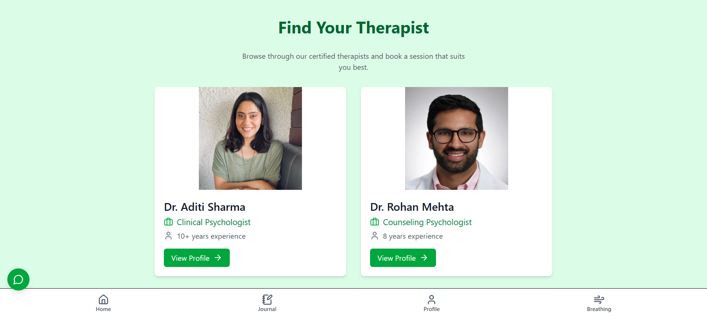  
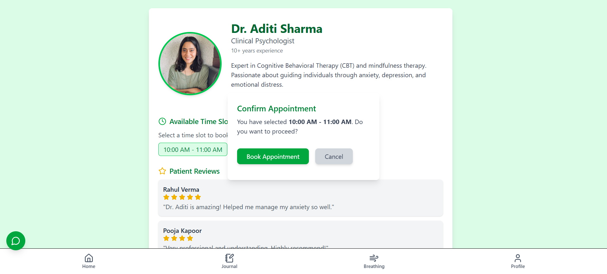  
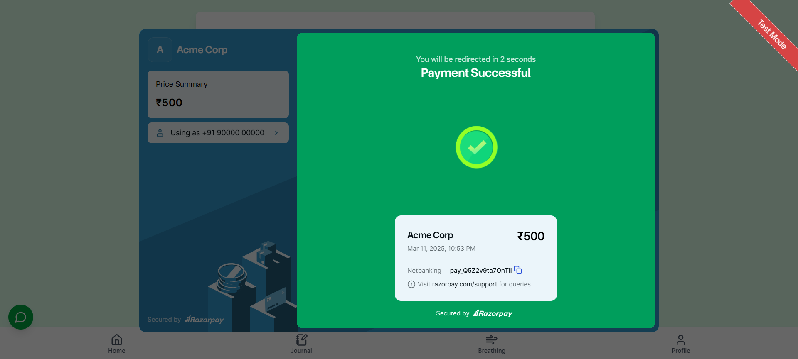  

### 🔹 **Mood-based Music**  
#### Curated playlists and music therapy recommendations tailored to your current mood.  
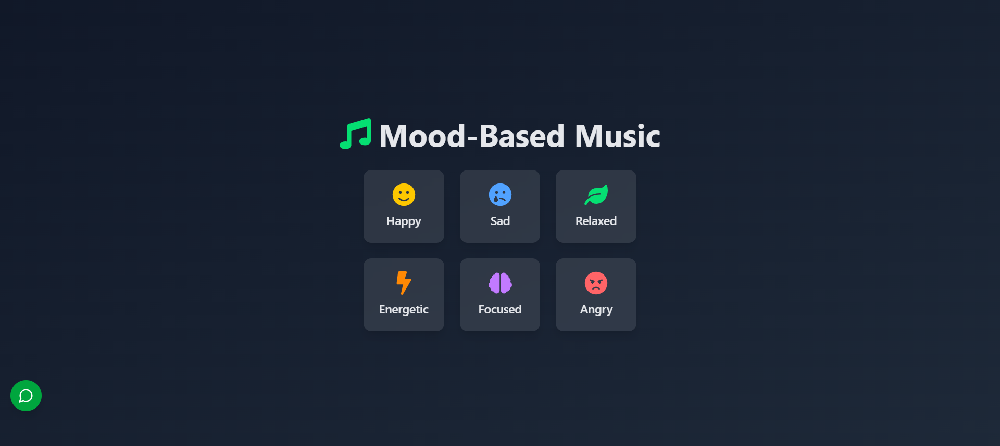  
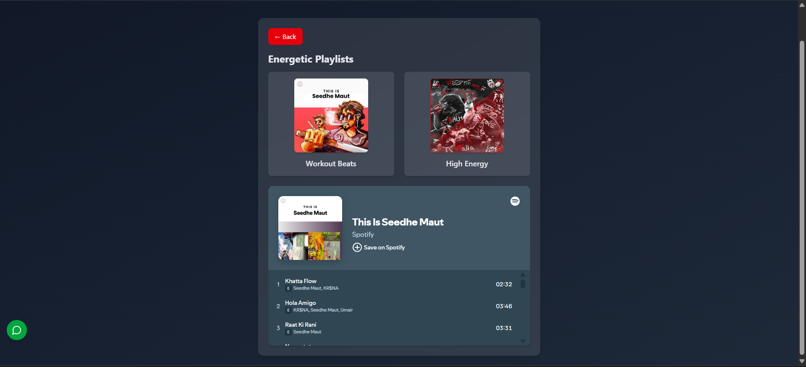  

### 🔹 **Chatbot**  
#### AI-powered chatbot for instant mental wellness support and guidance.  
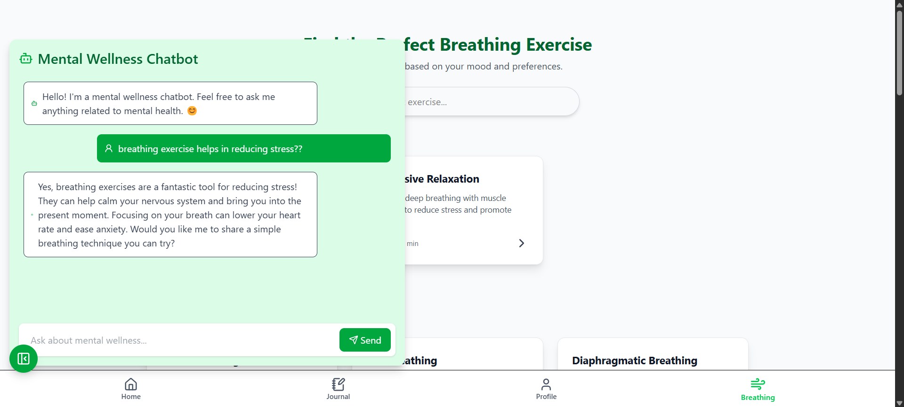  

### 🔹 **Profile Page**  
#### Personalized profile setup to track and manage your wellness journey.  
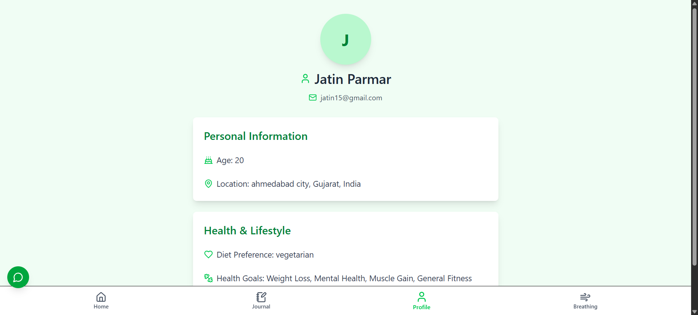  


---

---

## 🤝 Contributing
We welcome contributions! Feel free to submit a Pull Request.

---


 
 
